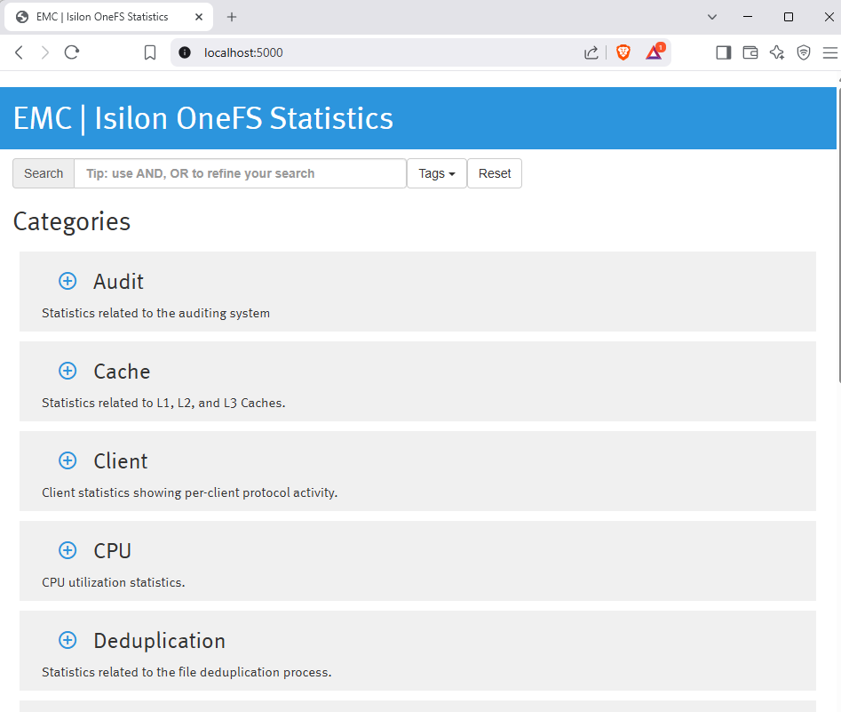
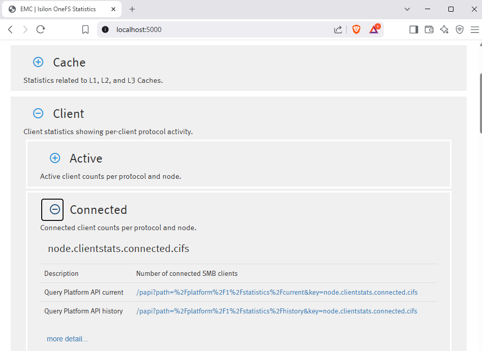
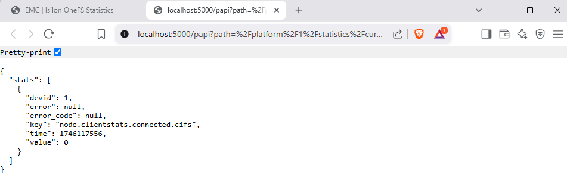

# Statistics Key Browser

This tool connects to a PowerScale cluster via PAPI and renders a browsable UI of all available statistics keys. It auto-categorizes and tags the keys, then generates a single-page web app for fast inspection.


- [Statistics Key Browser](#statistics-key-browser)
  - [✅ Quick Start](#-quick-start)
  - [Features](#features)
  - [Requirements](#requirements)
  - [Usage](#usage)
  - [Directory Overview](#directory-overview)
  - [Development Tips](#development-tips)
  - [Production](#production)
  - [What it Looks Like](#what-it-looks-like)
    - [Main Webpage](#main-webpage)
    - [Keys](#keys)
    - [Viewing a Result](#viewing-a-result)


## ✅ Quick Start

```bash
pip install -r requirements.txt
python stat_browser.py --host <cluster_ip> --user <username> --pass <password>
```

Open [http://localhost:5000](http://localhost:5000) in your browser.

If tagging data (`key_tags.json`, `key_cats.json`) is missing, the tool will automatically regenerate it from `.hexa` source definitions via `hexaparse.py`.

## Features

- Pulls all statistics keys via OneFS PAPI
- Categorizes and tags keys for clarity
- Renders a Flask-backed single-page UI
- Supports live queries through `/papi` proxy
- Fully standalone and portable

## Requirements

- Python 3.6+
- A modern web browser

Python dependencies:

```bash
pip install -r requirements.txt
```

## Usage

```bash
python stat_browser.py --host 10.10.25.155 --user admin --pass password
```

Alternatively, use environment variables:

```bash
export ISILON_HOST=10.10.25.155
export ISILON_USER=admin
export ISILON_PASS=password
python stat_browser.py
```

The following will be generated in `web_app/`:

- `index.html` – the rendered app generated from jinja2
- `js/keys.js` – metadata for all stat keys

## Directory Overview

| File/Dir                            | Purpose |
|------------------------------------|---------|
| `stat_browser.py`                  | Main entry point. Runs the Flask app. |
| `hexaparse.py`                     | Converts `*.hexa` definitions into `.json` mappings. |
| `stat_key_browser/browser_builder.py` | Orchestrates key collection and rendering. |
| `stat_key_browser/key_collector.py` | Pulls raw stats from the cluster via PAPI. |
| `stat_key_browser/tags/*.hexa`     | Human-written tag/category definitions. |
| `stat_key_browser/data/*.json`     | Generated tag/category mappings. |
| `stat_key_browser/templates/`      | Jinja2 HTML templates. |
| `web_app/`                         | Final static output (HTML, CSS, JS). |

## Development Tips

- Modify tag/category definitions in `.hexa` files
- Run `python hexaparse.py` to regenerate `.json` mappings
- Restart `stat_browser.py` to rebuild everything

## Production

To deploy this behind nginx or another WSGI-compatible server (e.g. Gunicorn), extract the static site (`web_app/`) and serve directly from disk. The live Flask app is meant as a quick start.

## What it Looks Like

### Main Webpage



### Keys



### Viewing a Result


